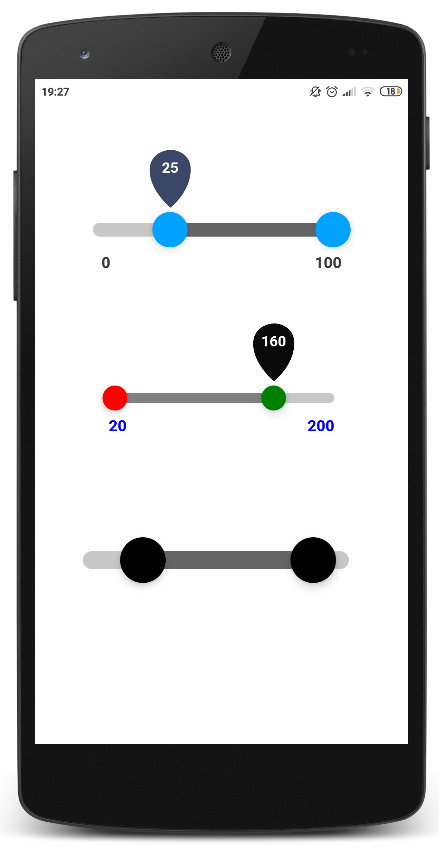

# react-native-range-slider-expo
##### Customizable range slider for react native apps

## Getting started
`npm i react-native-range-slider-expo`



## Usage
#### Example
```javascript
  import Slider from 'react-native-range-slider-expo';
```
```javascript
  const [fromValue, setFromValue] = useState(0);
  const [toValue, setToValue] = useState(0);
  const fromValueOnChange = value => setFromValue(value);
  const toValueOnChange = value => setToValue(value);
  return (
      <View style={{ flex: 1, padding: 50, justifyContent: 'space-evenly' }}>
          <Slider 
              fromValueOnChange={fromValueOnChange} 
              toValueOnChange={toValueOnChange}
              min={0}
              max={100}
              step={5}
          />
          <Slider  
              fromValueOnChange={fromValueOnChange} 
              toValueOnChange={toValueOnChange}
              min={20}
              max={200}
              step={20}
              styleSize='small'
              fromKnobColor='red'
              toKnobColor='green'
              valueLabelsBackgroundColor='rgb(10,10,10)'
              valueLabelsTextColor='white'
              rangeLabelsTextColor='blue'
              inRangeBarColor='grey'
              outOfRangeBarColor='rgb(200,200,200)'
          />
          <Slider  
              fromValueOnChange={fromValueOnChange} 
              toValueOnChange={toValueOnChange}
              min={0}
              max={10}
              styleSize='large'
              fromKnobColor='black'
              toKnobColor='black'
              valueLabelsBackgroundColor='rgb(0,80,100)'
              showRangeLabels={false}
              showValueLabels={false}
          />
      </View>
```

## API
| Property | Type | Required | 
| :---     |:----:|  :-----: | 
| min | boolean | yes |
| max | boolean | yes |
| fromValueOnChange | callback | yes |
| toValueOnChange | callback | yes |
| styleSize | string ( 'small' \| 'medium' \| 'large )  | no |
| fromKnobColor | string (color) | no |
| toKnobColor | string (color) | no |
| inRangeBarColor | string (color) | no |
| outOfRangeBarColor | string (color) | no |
| valueLabelsTextColor | string (color) | no |
| valueLabelsBackgroundColor | string (color) | no |
| rangeLabelsTextColor | string (color) | no |
| showRangeLabels | boolean | no |
| showValueLabels | boolean | no |

## License
This project is licensed under the MIT License
